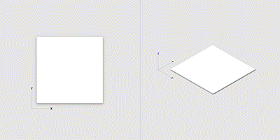
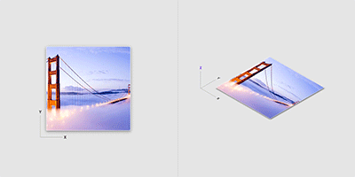
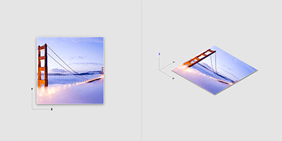
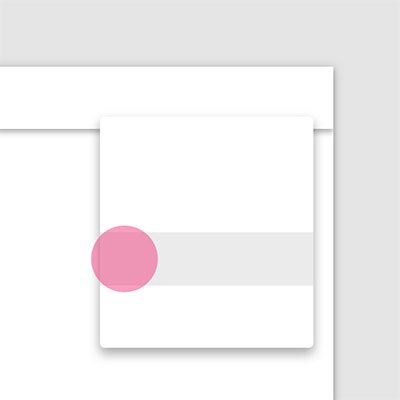
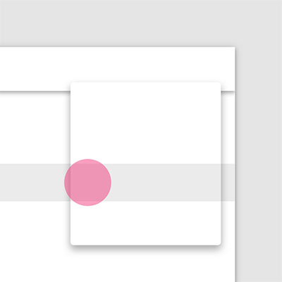
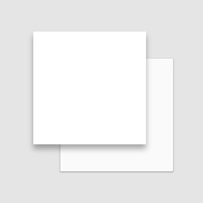
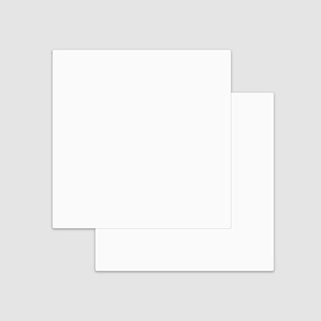
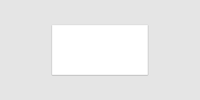
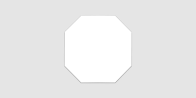

# Material Design 材料质感

## 阴影

不同高度的材料表面投射阴影。某一对象的“高度”决定了其具体“阴影”的表现形式。
阴影也是用来标识一个可操作的组件与背景层是分离的。

## 内容
### 内容不会为材质添加厚度，内容表达时不是单独的层。

<!--  -->

## 物理特性

### 材料是实体的，用户输入和交互不能穿透材料。

### 多个材质元素不能同时占据空间中的相同点。

### 材料的非气体表现

### 材料非流体表现

## 材料的变换

### 材料可以改变形状

### 材料可以改变透明度

