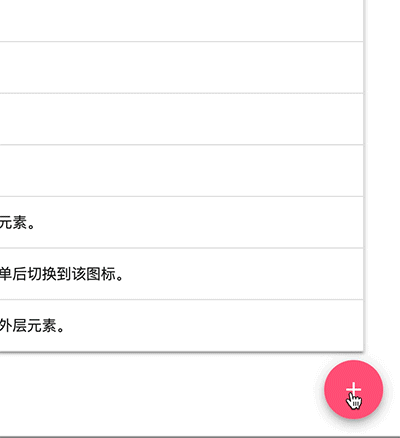

# Material Design ui组件库 material ui

Material UI是实现Material Design的React组件库。

[Material UI官网](https://material-ui.com/getting-started/installation/)

### 浮动操作按钮

浮动动作按钮 (FAB) 在屏幕上执行主要的或最常用的操作。 它出现在所有屏幕内容的前面, 通常作为圆形形状, 其中心有一个图标。

只在它是最适合呈现屏幕主要操作的方式时使用FAB。

每个屏幕建议只有一个浮动操作按钮来表示最常见的操作。

